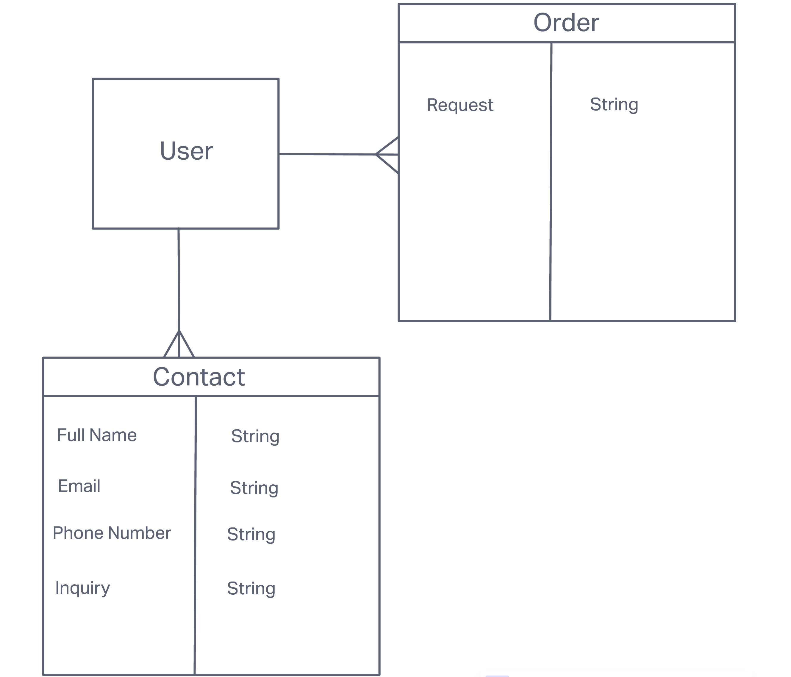
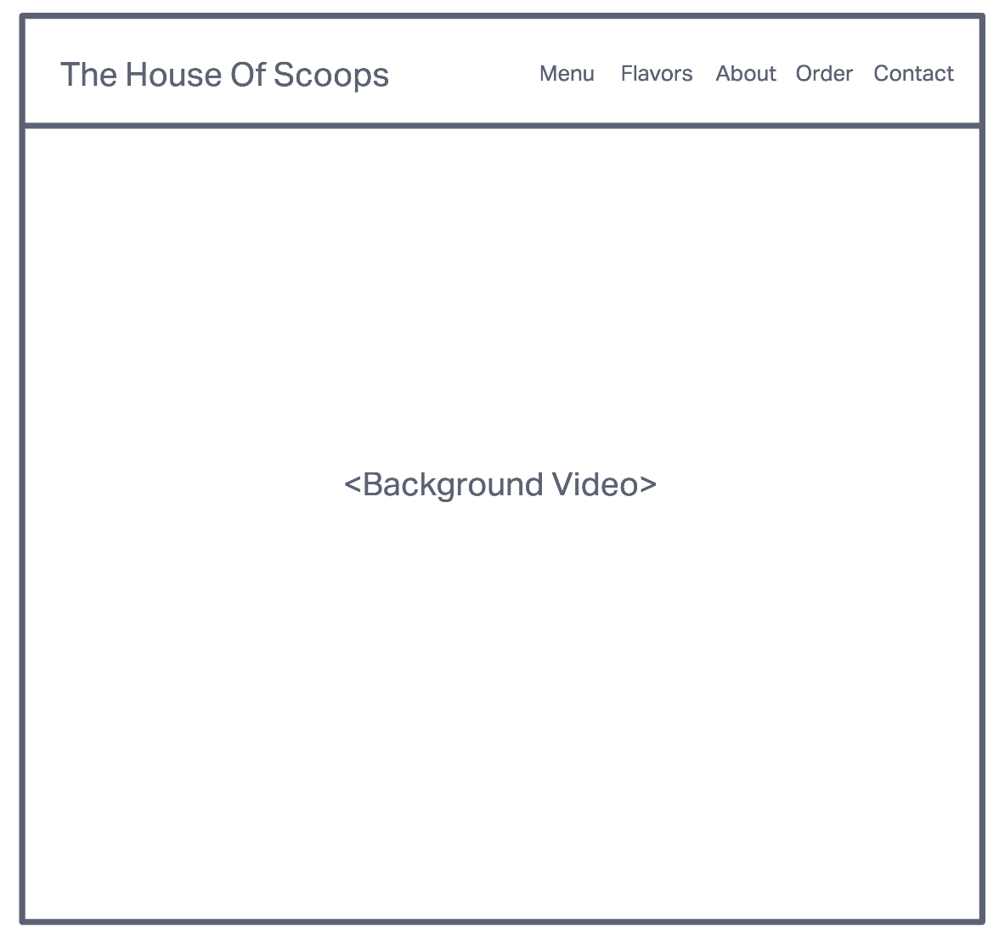
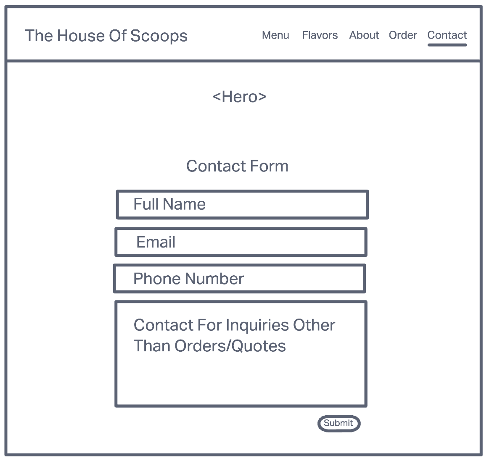
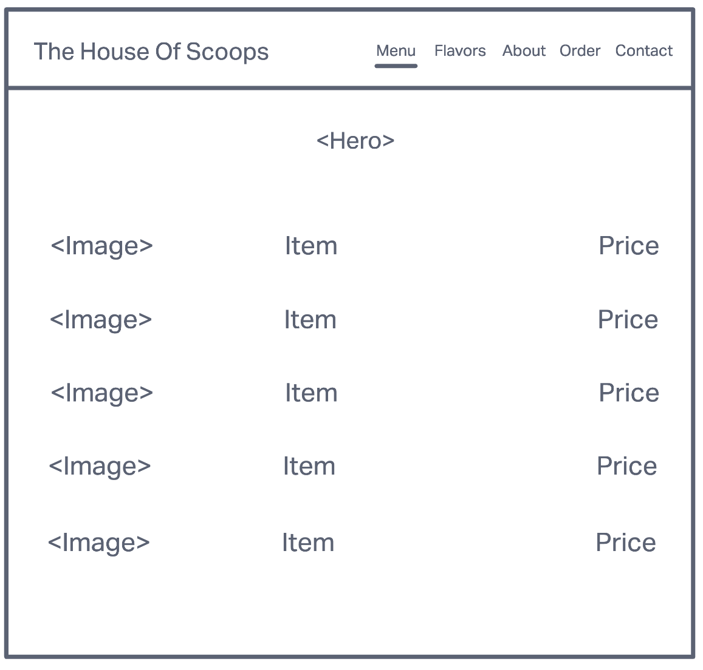
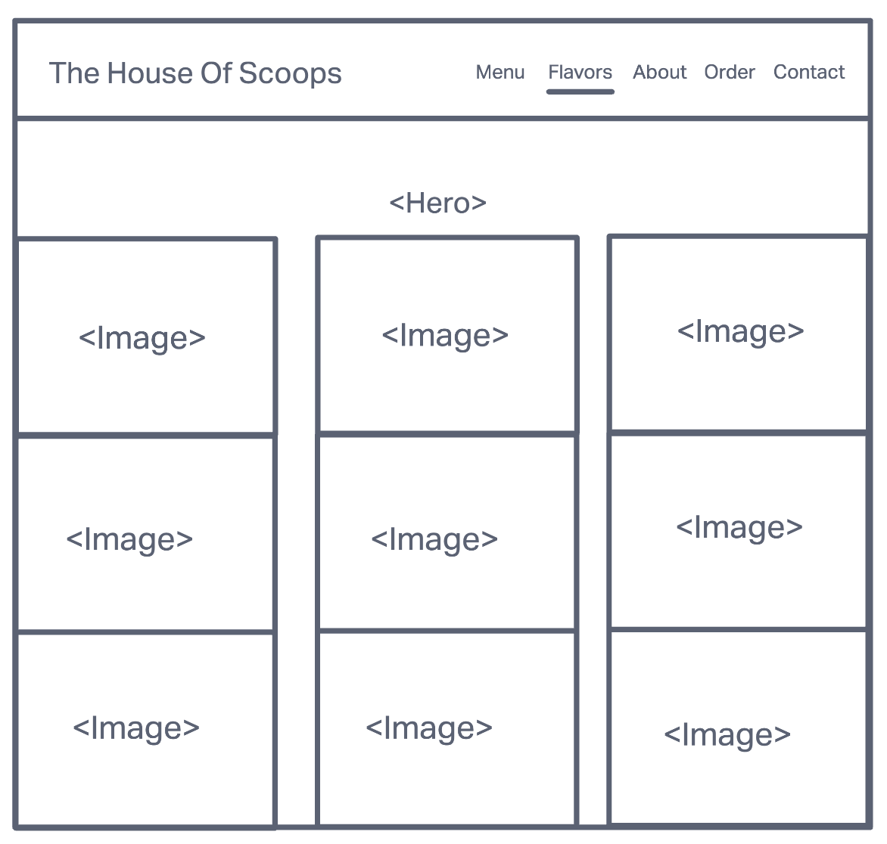
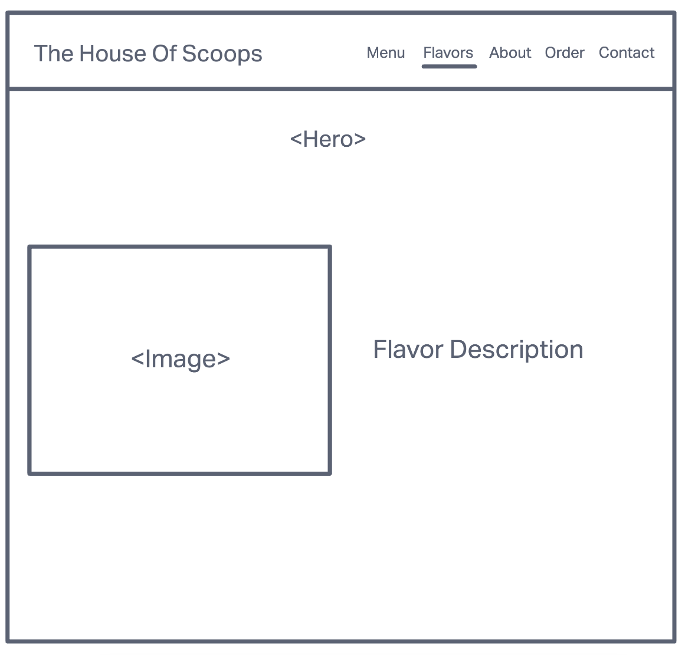
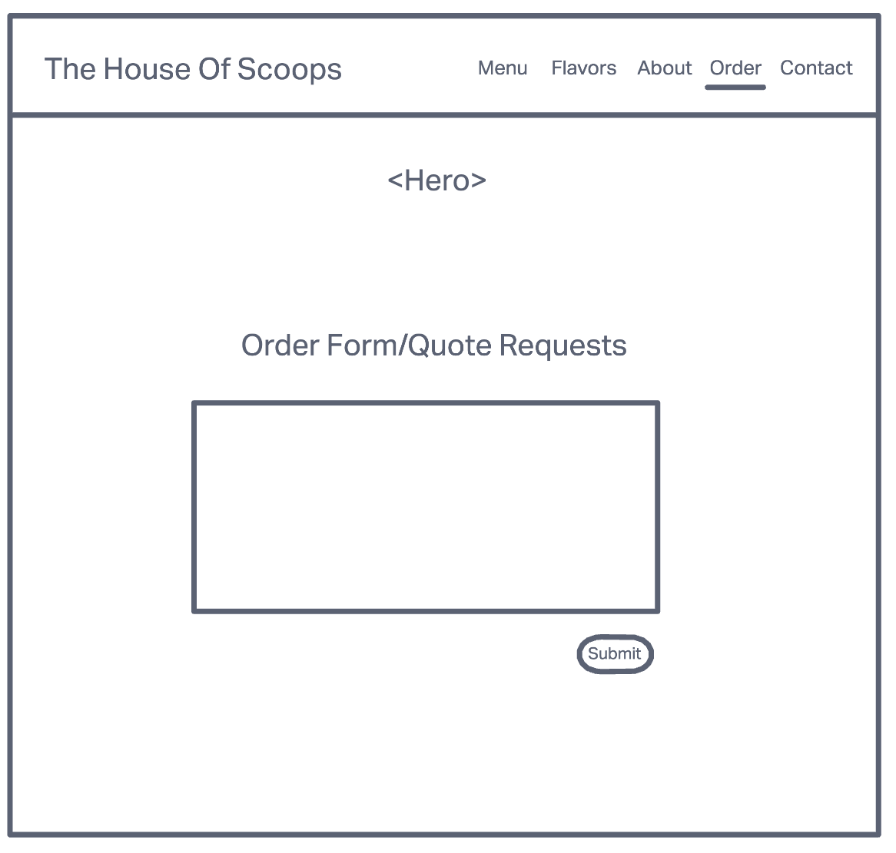
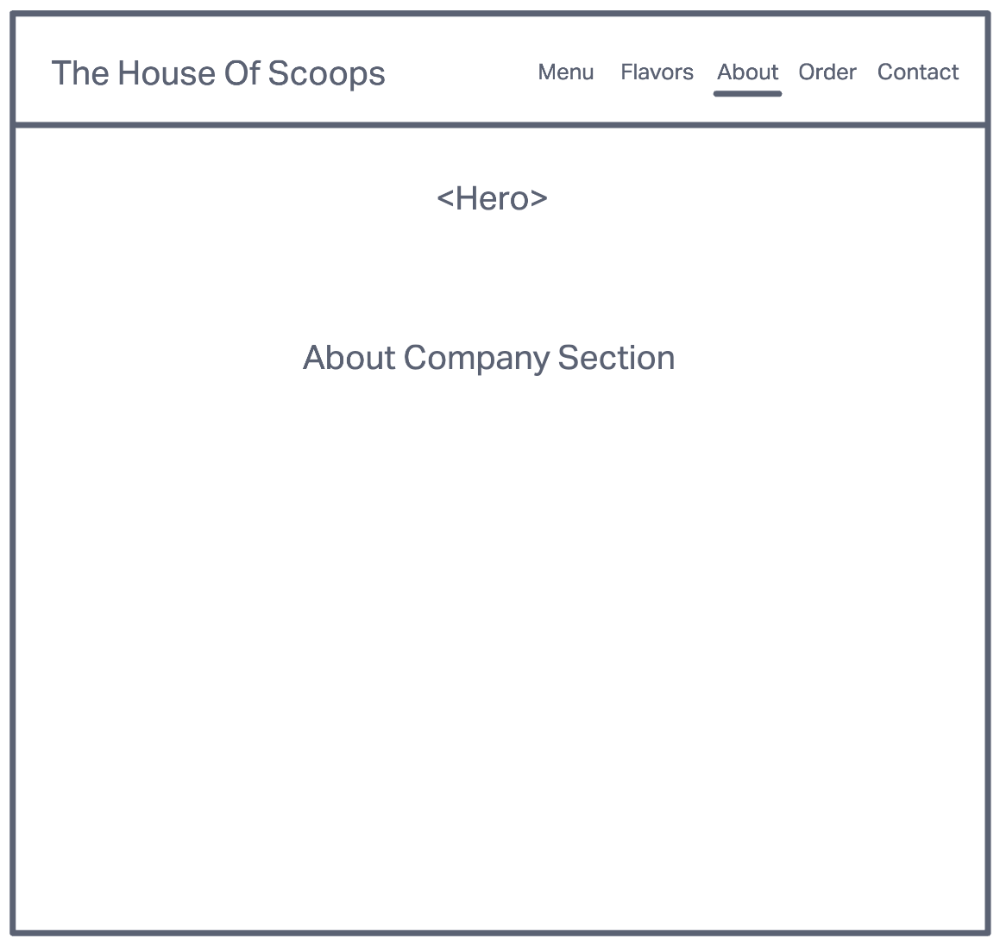

# The House Of Scoops 🍨🍦

#### Client facing web app that will allow customers to view menu, place orders, and contact.

###  - By Allen Timothe

## Technologies Used ⚙️ 🛠

* React JS
* Google Firebase
* PostgreSQL
* Ruby on Rails
* Materials UI
* Deployed using Heroku

## Live Link ‼️ 🚀 🔥 🎬

## Wire Frames

## Contact 📥 📨
* allen.timothe@gmail.com
